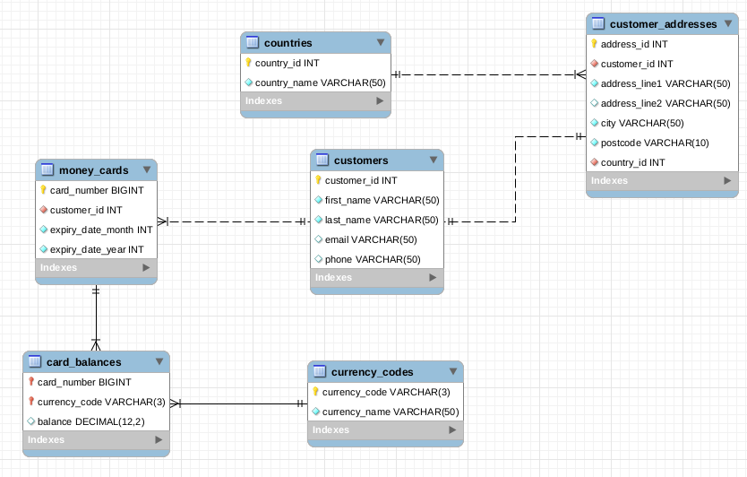

# Code First Girls - MySQL Project
This repository contains my CFG MySQL project and revalent scripts used to create the database.

## Project Idea
My database stores data about travel money cards. A travel money card is similar to a debit card. It can be pre-loaded with one or many currencies. 

A travel money card has card number and expiry date, just like a debit or credit card.

## Database Model

### Tables
| Table Name         | Description                                                                                                                                                                                                    |
|--------------------|----------------------------------------------------------------------------------------------------------------------------------------------------------------------------------------------------------------|
| `customers`          | Customers table holds customer data such as first name, last name, email and phone.                                                                                                                            |
| `customer_addresses` | This table is created to hold customer addresses, has columns for address, city, postcode and country. Addresses table linked to customers table using customer_id.                                            |
| `money_cards`        | Money Cards table has card numbers and expiry month and year.  It’s linked to customers table using customer_id.  It’s one to many relationship, means one customer can have multiple cards.                   |
| `card_balances`      | Balances table has card balances for each purchased currency.  It’s linked to money cards table using card_number. It’s one to many relationship means one card can hold multiple currencies at the same time. |
| `currency_codes`     | This is a reference data table for currency codes.                                                                                                                                                             |
| `countries`          | This is a reference data table for countries.                                                                                                                                                                  |

### Stored Functions and Procedures
| Name                           | Type             | Description                                                                                                                                    |
|--------------------------------|------------------|------------------------------------------------------------------------------------------------------------------------------------------------|
| `error_if_invalid_card`          | Function         | Throws an error if money card details are invalid.                                                                                             |
| `error_if_invalid_currency_code` | Function         | Throws an error if currency code is invalid.                                                                                                   |
| `get_country_id`                 | Function         | Returns country_id for the country name provided.                                                                                              |
| `get_human_readable_expiry_date` | Function         | Returns expiry date in human-friendly format (for example: June 2026)                                                                          |
| `get_random_card_expiry_date`    | Function         | Returns a randomly generated card expiry date.                                                                                                 |
| `create_new_customer`            | Stored Procedure | Encapsulates login to create a new customer with address. It also adds a card for the customer and load it with requested currency and amount. |
| `reload_card`                    | Stored Procedure | Reload card with requested currency and amount.                                                                                                |

## How to use it?
- Restore the database backup file from `./navdeep_kaur_sql_project/db_back/travel_money_cards_db_backup.sql`
- Check tables, views, stored functions and procedures
- Run sample queries from `./navdeep_kaur_sql_project/project-sample-queries`
